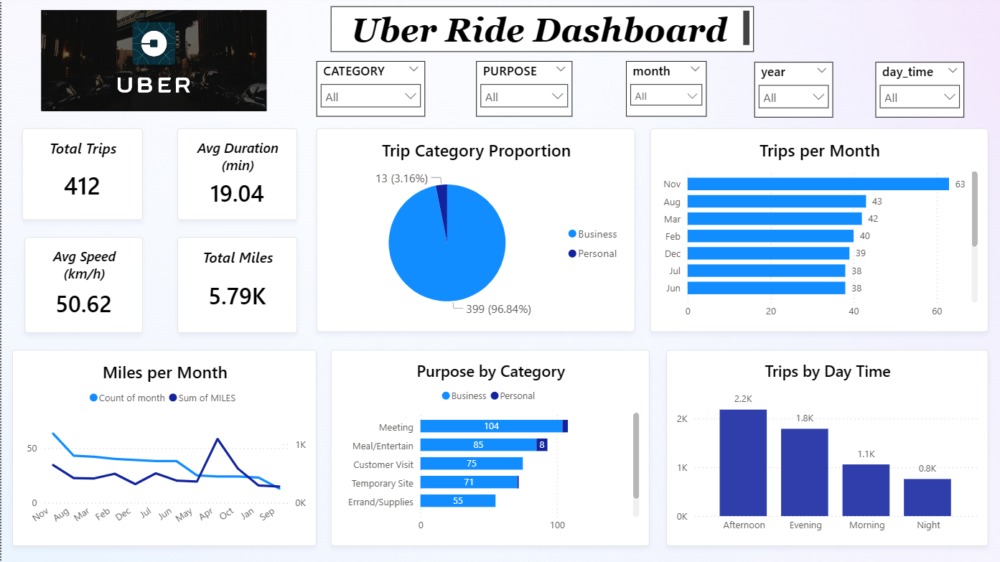

# Uber-Ride-Data-Analysis
🔍 Project Overview
- This project analyzes Uber ride data to uncover trends in ride frequency, purpose, time-of-day usage, distance traveled, and more. Using Python for data cleaning and preprocessing and Power BI for visual analytics, it provides actionable insights through an interactive dashboard.

📁 Project Structure 
- uber.ipynb	
- UberDataset.csv	
- UberDataset_Cleaned.csv
- Dashboard.png	
- Uber_DAA.pbix 
- README.md	

🧪 Tools & Technologies
- Python (Pandas, NumPy, Seaborn, Matplotlib)

- Power BI

- Jupyter Notebook

- DAX (for dashboard metrics and filters)

🔄 Data Preprocessing Workflow (Jupyter Notebook)
1. Data Import
- Loaded and inspected Uber ride data with basic summaries.

2. Missing Value Treatment
- Handled nulls using forward-fill and mode-based imputation, especially in the PURPOSE and CATEGORY columns.

3. Datetime Conversion & Feature Extraction
- Converted START_DATE and END_DATE to datetime
- Extracted: year, month, day, hour, minute, day_name, day_time_slot

4.Trip Duration Calculation
- Calculated total trip duration in minutes using start and end times.

5.Miles Aggregation
- Summed miles per trip, per category, time slot, etc., for visual analysis.

6.Final Dataset
- Cleaned and saved the data to UberDataset_Cleaned.csv for use in Power BI.

📊 Dashboard Insights (Power BI)
1. KPI Cards:
- Total Trips 
- Avg Duration
- Avg Speed
- Total Miles

2. 📅 Monthly Trends

- Total trips by month

- Miles traveled each month (sorted Jan → Dec)

4. 📈 Purpose & Category Breakdown

- Pie chart of Business vs. Personal rides

- Purpose of rides grouped by category

5. 🕓 Time of Day Trends

- Miles traveled during morning, afternoon, evening, night

- Helps understand rider behavior by time slots

6. 🗓️ Day of Week Distribution

- Visual showing which weekdays are most active for rides

✅ Key Insights
- ~96% of trips were Business-related.

- Most active month: November

- Afternoons are the busiest times for travel.

- "Meeting" and "Meal/Entertainment" dominate as ride purposes.

## 📊 Dashboard Preview

